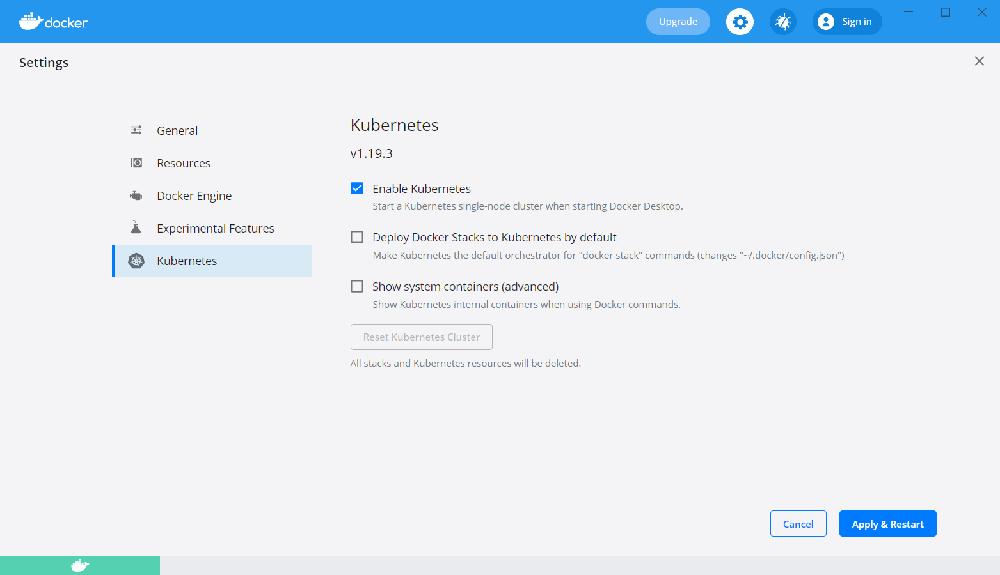

# Kubernetes step by step tutorial

## Step 0 - Enable Kubernetes


## Step 1 - Pod
```kubectl apply -f pod.yaml```

```kubectl get pods```

```kubectl port-forward nginx-pod 8081:80```

Go to http://localhost:8081

```kubectl delete -f pod.yaml```


## Step 2 - Replica Set

```kubectl apply -f rs.yaml```

```kubectl get rs```

```kubectl get pods```

```kubectl delete pod nginx-replica-set-<POD_ID>```

```kubectl get pods```

```kubectl scale rs nginx-replica-set --replicas=5```

```kubectl get pods```

```kubectl scale rs nginx-replica-set --replicas=3```

```kubectl get pods```

```kubectl apply -f pod.yaml```

```kubectl get pods```

```kubectl delete -f rs.yaml```

## Step 3 - Deployment

```kubectl apply -f deployment.yaml```

```kubectl get pods```

```kubectl get rs```

```kubectl get deployments```

```kubectl scale deployments/nginx-deployment --replicas=5```

```kubectl get pods```

```kubectl set image deployments/nginx-deployment nginx=bmoshe/static-content-per-pod:latest --record```

```kubectl rollout history deployment/nginx-deployment```

```kubectl get pods```

```kubectl port-forward nginx-deployment-<POD_ID> 8081:80```

Go to http://localhost:8081 and see the new nginbix image

```kubectl rollout undo deployment/nginx-deployment```

```kubectl rollout history deployment/nginx-deployment```

```kubectl get pods```

```kubectl port-forward nginx-deployment-<POD_ID> 8081:80```

Go to http://localhost:8081 and verify the rollback worked

```kubectl delete -f deployment.yaml```

## Step 4 - Service

```kubectl apply -f deployment.yaml -f service.yaml```

```kubectl get services```

```kubectl describe service nginx-service```

Go to http://localhost:31000

```kubectl set image deployments/nginx-deployment nginx=bmoshe/static-content-per-pod:latest --record```

```kubectl scale deployments/nginx-deployment --replicas=5```

Visit http://localhost:31000 multiple times from incognito to verify multiple pods are called

```kubectl delete -f deployment -f service.yaml```

## Step 5 - Ingress

```kubectl apply -f https://raw.githubusercontent.com/kubernetes/ingress-nginx/controller-v1.0.4/deploy/static/provider/cloud/deploy.yaml```

```kubectl get pods --namespace=ingress-nginx```

```kubectl apply -f ./nginx/deployment.yaml -f ./nginbix/deployment.yaml```

```kubectl get pods```

```kubectl get services```

```kubectl apply -f nginx-ingress.yaml```

```kubectl get ingress```

```kubectl describe ingress nginx-ingress```

```kubectl port-forward --namespace=ingress-nginx service/ingress-nginx-controller 8080:80```

Add to ```/ect/hosts``` 127.0.0.1 my-domain.com 

Visit http://my-domain.com:8080/nginx

Visit http://my-domain.com:8080/nginbix

Visit http://my-domain.com:8080/bla

```kubectl delete -f nginx-ingress.yaml```

```kubectl delete -f ./nginbix/deployment.yaml -f ./nginx/deployment.yaml```

## Step 6 - Helm

```brew install helm```

```helm install nginx example-chart --dry-run```

```helm install nginx example-chart```

```kubectl get pods```

```helm list```

```helm install nginbix example-chart --set replicaCount=5```

```kubectl get pods```

```helm list```

```helm history nginbix```

```helm upgrade nginbix example-chart --set image.repository=bmoshe/static-content-per-pod,image.tag="latest"```

```helm history nginbix```

```kubectl apply -f nginx-ingress.yaml```

```kubectl port-forward --namespace=ingress-nginx service/ingress-nginx-controller 8080:80```

Visit http://my-domain.com/nginx

Visit http://my-domain.com/nginbix

```helm rollback nginbix 1```

```helm history nginbix```

Visit http://my-domain.com/nginbix

```helm delete nginx nginbix```

```kubectl delete -f nginx-ingress.yaml```

## Step 7 - Helm namespaces

```kubectl create ns qa```

```kubectl create ns prod```

```kubectl get ns```

```helm package example-chart```

```helm install nginx example-chart-0.1.0.tgz --namespace=qa```

```kubectl get pods```

```kubectl get pods --namespace=qa```

```helm history nginx```

```helm history nginx --namespace=qa```

```helm install nginx example-chart-0.1.0.tgz --namespace=prod --dry-run```

```helm install nginx example-chart-0.1.0.tgz --namespace=prod```

```kubectl get pods --namespace=prod```

```kubectl exec nginx-deployment-<ID> --namespace=prod -- nginx -v```

```helm history nginx --namespace=prod```

Edit `example-chart/Chart.yaml` with `appVersion: "1.21.0"`

```helm upgrade nginx example-chart --set replicaCount=6,image.tag="1.21.0" --namespace=prod --dry-run```

```helm upgrade nginx example-chart --set replicaCount=6,image.tag="1.21.0" --namespace=prod```

```kubectl get pods --namespace=prod```

```kubectl exec nginx-deployment-<ID> --namespace=prod -- nginx -v```

```helm history --namespace=prod```

```helm rollback nginx 1 --namespace=prod```

```kubectl get pods --namespace=prod```

```kubectl exec nginx-deployment-<ID> --namespace=prod -- nginx -v```

```helm history nginx --namespace=prod```

```helm delete nginx --namespace=qa```

```helm delete nginx --namespace=prod``` 

```kubectl delete ns qa prod```
